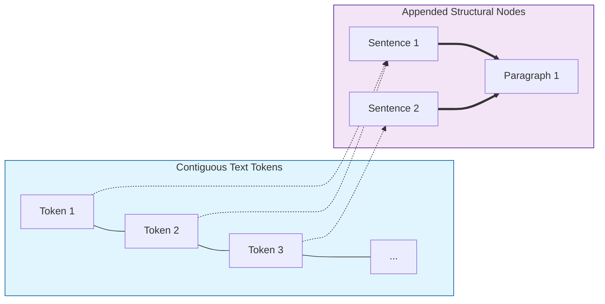

# 🕸️ IndraQuantum

> **"In the heaven of Indra, there is said to be a network of pearls, so arranged that if you look at one you see all the others reflected in it."** — *Avatamsaka Sutra*

**IndraQuantum** is a **Quantum-Inspired Language Model (QILM)** designed to bring extreme parameter efficiency to Natural Language Processing. By replacing standard vector embeddings with **Complex-Valued State Vectors** and utilizing **Tensor Network** decomposition, IndraQuantum achieves expressive power comparable to larger models while fitting on consumer hardware (e.g., 6GB VRAM).

[](https://opensource.org/licenses/MIT)
[](https://www.python.org/downloads/)
[](https://pytorch.org/)

---

## 🌌 The Concept

Standard Transformers treat tokens as static points in high-dimensional space. **IndraQuantum** treats them as **Quantum States** in a complex Hilbert space:

1.  **Superposition (The Particle):** Tokens are encoded as complex numbers ($z = r e^{i\theta}$).
    * **Magnitude ($r$):** Semantic meaning (e.g., "King").
    * **Phase ($\theta$):** Structural context, rotated by the document graph.
2.  **Entanglement (The Graph):** Instead of standard positional encodings, we use **Graph-Induced Phase Shift**. Relationships between Paragraphs, Sentences, and Words create "interference patterns" that determine attention.
3.  **Measurement (The Output):** The model predicts probabilities using the **Born Rule** ($P = |\psi|^2$), collapsing the complex state into real-valued logits compatible with standard LLMs.

---

## ⚡ Key Features

* **Complex Embeddings:** 2x information density per parameter compared to real-valued floats.
* **Tensor Train Decomposition:** Replaces massive Linear layers with efficient low-rank tensor networks, reducing parameters by **~10x**.
* **Knowledge Distillation Bridge:** Trains a compact "Quantum Student" to mimic a massive "Classical Teacher" (e.g., Qwen-2.5, Llama-3) by aligning their probability distributions.
* **Consumer Hardware Ready:** Designed specifically to train and run on GPUs with **<8GB VRAM**.

---

## 🧠 Architecture Comparison

| **Embedding** | `Float32` Vector | `Complex64` Wavefunction |
| **Attention** | Dot Product ($Q K^T$) | **Complex Edge-Biased** ($|Q^\dagger K|^2 + \text{Bias}$) |
| **Structure** | Absolute Positional Encoding | **Graph Topology + Local Window** |
| **FFN Layers** | Dense Matrices | **Complex FFN with CReLU** |
| **Output** | Linear Projection | **Born Rule Measurement** |

---

## 🏛️ Complex Edge-Biased Attention

IndraQuantum uses a novel attention mechanism designed for both **Quantum-Inspired Expressivity** and **Hardware Efficiency**:

### 1. The Quantum Core ($|Q^\dagger K|^2$)
Instead of the standard dot product, we compute attention scores using the squared magnitude of the complex inner product. This mimics quantum interference, where "phase" (context) determines constructive or destructive interference between tokens.

### 2. Hardware-Efficient Topology
We use an **Appended Topology** to organize the input sequence, ensuring compatibility with fast local-window operations (like FlashAttention):



*   **Tokens (0..N):** Represent the actual text. They are kept contiguous to allow efficient sliding window attention.
*   **Structure (N..M):** Sentence and Paragraph nodes are appended at the end. They act as "global" routing nodes that attend to their constituent tokens.

### 3. Decoupled Edge Biases
The attention scores are modulated by two distinct, additive biases:

```mermaid
flowchart TD
    Input[Complex Input State] --> Q[Query Proj]
    Input --> K[Key Proj]
    
    Q & K --> Attn{Complex Attention<br>|Q* K|^2}
    
    subgraph Biases [Additive Biases]
        LB[Local Window Bias<br>(Distance Mask)]
        HB[Hierarchy Bias<br>(Graph Edges)]
    end
    
    Biases --> Attn
    
    Attn --> Softmax[Softmax]
    Softmax --> Output[Output State]
    
    style Attn fill:#fff9c4,stroke:#fbc02d
    style Biases fill:#e0f2f1,stroke:#00695c
```

*   **Local Window Bias:** A distance-based bias applied only to the contiguous text tokens. It enforces a strong local context (e.g., window size = 16), allowing the model to capture immediate syntactic dependencies efficiently.
*   **Hierarchy Bias:** A learned bias applied to edges defined by the document graph (Token $\leftrightarrow$ Sentence $\leftrightarrow$ Paragraph). This allows the model to "jump" from a word to its sentence node and back to another word, enabling long-range reasoning without an expensive $O(N^2)$ global attention map.

---

## 🚀 Quick Start

### 1. Installation
```bash
git clone https://github.com/divyang4481/IndraQuantum.git
cd IndraQuantum
pip install -r requirements.txt
```

### 2. Training (Knowledge Distillation)

Train the Quantum Student using a pre-trained Classical Teacher. This script automatically handles the complex-to-real domain bridging.

```bash
# Optimized for 6GB VRAM
python scripts/train_quantum.py \
    --teacher "Qwen/Qwen2.5-0.5B-Instruct" \
    --dataset "data/corpus.txt" \
    --dim 128 \
    --batch_size 4
```

### 3. Inference

```python
from indra.models.quantum_core import IndraQuantum

model = IndraQuantum.from_pretrained("checkpoints/indra_v1")
output = model.generate("The nature of reality is")
print(output)
```

---

## 📂 Project Structure

```text
IndraQuantum/
├── indra/
│   ├── models/
│   │   ├── quantum_core.py    # Core Complex-Valued Model
│   │   ├── tensor_layers.py   # Tensor Train Linear Layers
│   │   └── interference.py    # Quantum Attention Mechanism
│   ├── graph/
│   │   └── phase_shift.py     # Graph-to-Phase logic
│   └── utils/
│       └── complex_ops.py     # Complex number helpers
├── scripts/
│   ├── train_quantum.py       # KD Training Loop
│   └── benchmark_param.py     # Parameter efficiency tests
└── configs/
    └── quantum_6gb.yaml       # Config for low VRAM
```

---

## 📜 Theory & Citations

This project is a novel synthesis of concepts from:

* *RotatE: Knowledge Graph Embedding by Relational Rotation* (Sun et al., 2019)
* *Quantum Knowledge Distillation for Large Language Models* (2025)
* *Encoding Word Order in Complex Embeddings* (Wang et al., 2020)

---

## 🤝 Contributing

We welcome explorers! If you are interested in **Quantum Machine Learning**, **Tensor Networks**, or **Efficient NLP**, please open an issue or PR.

**"As above, so below."** — *The architecture of the cosmos, mirrored in code.*
