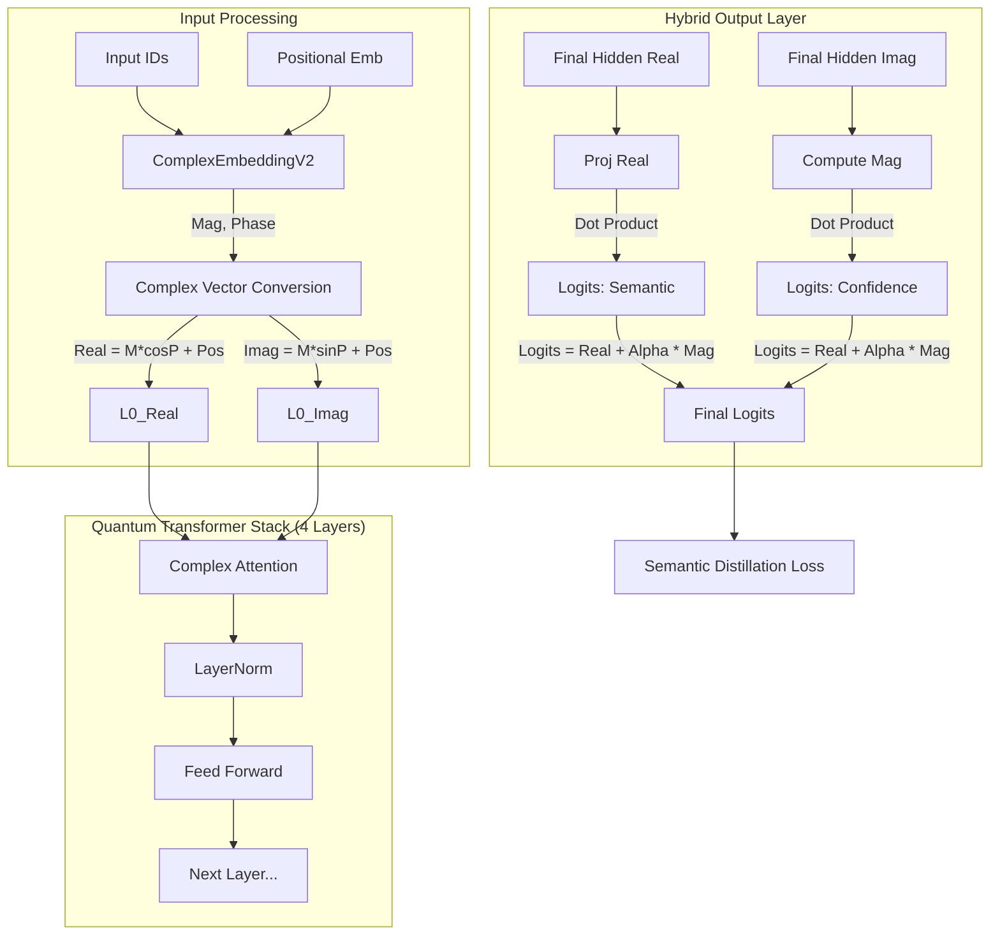

# IndraQuantum Phase 2 (v4 Unified) - Design Documentation

## 1. Overview

**IndraQuantum Phase 2** is a quantum-inspired language model designed to separate **Semantic Meaning** ("What is it?") from **Confidence/Salience** ("How important/certain is it?") within the embedding space. Unlike standard LLMs which treat tokens as static vectors, IndraQuantum treats them as **Complex Numbers** ($z = a + bi$) or phasors ($M \cdot e^{iP}$), allowing for richer interaction mechanics.

### Key Philosophy

- **Magnitude (M):** Represents **Salience & Confidence**. Common, important words (e.g., "the", "must") have high magnitude.
- **Phase (P):** Represents **Semantic Context**. The actual meaning of the word is encoded in its rotation in the vector space.
- **Hybrid Output:** The final prediction is a weighted sum of Semantic Alignment and Magnitude Salience, controlled by a learnable parameter $\alpha$.

---

## 2. Architecture Diagram

---

## 3. Mathematical Theory & Components

### 3.1 Complex Embedding (`ComplexEmbeddingV2`)

Standard embeddings are just vectors. Ours are split into **Magnitude** and **Phase**.

**Mathematics:**
For a token $t$:

$$
M_t = \text{softplus}(W_{mag}[t]) + \epsilon \quad (\text{Strictly Positive})
$$

$$
P_t = W_{phase}[t] \quad (\text{Unconstrained Angle})
$$

$$
z_t = M_t \cdot (\cos(P_t) + i\sin(P_t))
$$

- **Why Softplus?** Magnitudes must be positive physical quantities.
- **Code Reference:** `indra/models/embedding_v2.py`

### 3.2 Complex Attention (`ComplexAttention`)

Standard attention is $softmax(QK^T)$. Complex attention involves complex multiplication (rotation + scaling).

**Mathematics:**
Given Query $Q = Q_r + iQ_i$ and Key $K = K_r + iK_i$:

$$
AttentionScore = Re(Q \cdot K^*) = Q_r K_r + Q_i K_i
$$

This measures how much the Query and Key are "aligned" in the complex plane (both direction and magnitude).

To save compute in this Tiny version, we approximate this using split Real/Imaginary attention heads where `Real` attends to `Real` and `Imag` attends to `Imag`, effectively creating two parallel "worlds" that mix in the FFN layers.

- **Size:** 32000 Vocab, 128 Dimension, 4 Heads.
- **Code Reference:** `indra/models/attention.py`

### 3.3 Hybrid Output Layer (`HybridOutput`)

This is the most critical innovation. It separates the "Meaning" prediction from the "Importance" prediction.

**The Equation:**

$$
\text{Logits} = \underbrace{\frac{(h_{real} \cdot E_{real}^T)}{\sqrt{d}}}_{\text{Semantic Channel}} + \alpha \cdot \underbrace{\frac{(h_{mag} \cdot M^T)}{\sqrt{d}}}_{\text{Confidence Channel}}
$$

1.  **Semantic Channel ($Real$):** Checks if the hidden state vector points in the same direction as the token embedding's "Meaning" vector ($E_{real} = M \cos P$).
2.  **Confidence Channel ($Mag$):** Checks if the hidden state has high energy ($h_{mag}$) and correlates it with high-energy words ($M$). This acts as a "Frequency Bias" or "Prior Probability" mechanism.
3.  **Alpha ($\alpha$):** A learnable gate.
    - **Low $\alpha$:** Model relies on meaning (Semantic).
    - **High $\alpha$:** Model mimics the teacher's statistical confidence (Magnitude).
    - **Training Fix:** We clamp $\alpha \le 0.05$ initially to prevent the model from ignoring semantics and only predicting frequent words ("Magnitude Collapse").

- **Code Reference:** `indra/models/output.py`

---

## 4. Semantic Distillation Loss (`SemanticDistillationLoss`)

We don't just minimize prediction error; we align the quantum state with a **Teacher Model** (TinyLlama).

$$
\mathcal{L}_{total} = \mathcal{L}_{CE} + w_{KD}\mathcal{L}_{KD} + w_{aux}\mathcal{L}_{Phase} + w_{aux}\mathcal{L}_{Mag}
$$

### 4.1 Cross Entropy ($\mathcal{L}_{CE}$)

Standard classification loss against the ground truth next token.

$$
\mathcal{L}_{CE} = -\log(P(\text{target} | \text{input}))
$$

### 4.2 Knowledge Distillation ($\mathcal{L}_{KD}$)

The student tries to match the Teacher's probability distribution using KL Divergence.

$$
\mathcal{L}_{KD} = KL(P_{student} || P_{teacher})
$$

- **Masking:** We strictly mask padding tokens so the student doesn't learn to predict `<pad>`.

### 4.3 Phase Loss ($\mathcal{L}_{Phase}$) - "Uncertainty Distillation"

We map the Teacher's **Entropy** (Uncertainty) to the Student's **Phase**.

- **High Entropy (Confused Teacher):** Target Phase $\to \pi$ (Cancellation/Noise).
- **Low Entropy (Sure Teacher):** Target Phase $\to 0$ (Alignment).

$$
\text{TargetPhase} = \frac{Entropy(T)}{\text{MaxEntropy}} \cdot \pi
$$

### 4.4 Magnitude Loss ($\mathcal{L}_{Mag}$) - "Salience Distillation"

We map the Teacher's **Max Confidence** to the Student's **Magnitude**.

- **High Confidence:** Token is "Salient" (High Mag).
- **Low Confidence:** Token is "Background" (Low Mag).

$$
\text{TargetMag} = \max(P_{teacher}) \times 1.0 \quad (\text{Previously 5.0, scaled down})
$$

---

## 5. Training Dynamics & "Pitfalls"

### The Magnitude Collapse (Solved)

- **Symptom:** Model generates only "the", "a", and numbers.
- **Cause:** The Magnitude Channel is "easier" to learn. If $\alpha$ is large, the model just predicts high-magnitude tokens everywhere to minimize KD loss quickly, ignoring the complex Semantic interactions.
- **Solution:**
  1.  **Clamping Alpha:** We force $\alpha \le 0.05$.
  2.  **Scaling Fix:** We reduced `TargetMag` multiplier from 5.0 to 1.0 and added `1/sqrt(d)` scaling to logits to prevent gradient explosion.

### Terminology Glossary

- **Logits:** Raw prediction scores before Softmax.
- **Softplus:** Activation function $\ln(1+e^x)$ used to ensure values (like Magnitude) are always positive.
- **Hyperparameters:**
  - `Vocab`: 32000
  - `Dim`: 128 (Small, efficient)
  - `Layers`: 4
  - `Heads`: 4
  - `Context`: 256 tokens

---

This design allows **IndraQuantum** to be a "Tiny Giant"—learning rich relationships in a small parameter space by utilizing the extra degree of freedom provided by the complex phase.
